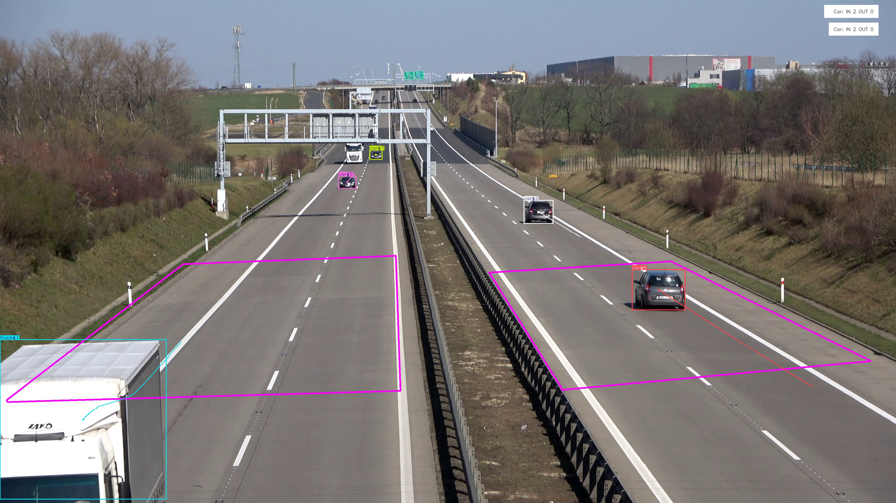

# Object Counting in Multiple Zones

## Introduction
This project showcases the application of object detection and counting using the Ultralytics YOLOv8 model in multiple predefined regions of a video. The primary objective is to demonstrate the capability to detect and count objects within specific zones of interest, which can be particularly useful in various applications like traffic monitoring, crowd management, and industrial automation.

## Model
**Ultralytics YOLOv8**
- YOLO (You Only Look Once) is a state-of-the-art, real-time object detection system.
- The YOLOv8 model utilized in this project is a segmentation variant, pre-trained on a vast dataset to accurately detect and segment objects in diverse environments.



## Methodology
### Steps Involved:
1. **Model Loading**: The YOLOv8 model is loaded for object detection and segmentation.
2. **Video Capture**: A video is read frame by frame for processing.
3. **Zone Definition**: Multiple zones of interest are defined as polygons within the video frame where object counting is performed.
4. **Object Detection and Tracking**: Objects within the frame are detected and tracked across frames.
5. **Object Counting**: Objects entering the defined zones are counted separately for each zone.

### Key Components:
- **YOLOv8 Model**: Utilized for high-precision object detection.
- **Multiple Zones**: Allows counting objects in different predefined regions.
- **ObjectCounter**: Custom solution leveraging YOLOv8 for counting objects within specified regions.

## Implementation

### Dependencies
To run the project, ensure you have the following dependencies installed:
- OpenCV
- Ultralytics YOLO
- Shapely (for handling geometric shapes)

### Code Example
Here's a snippet of the main code used for object detection and counting in multiple zones:

```python
import cv2
from ultralytics import YOLO, solutions
from ultralytics.utils.plotting import Annotator

# Load the model
model = YOLO("./data/yolov8x-seg.pt")

# Open video capture
cap = cv2.VideoCapture("./data/data.mp4")
w, h, fps = (int(cap.get(x)) for x in (cv2.CAP_PROP_FRAME_WIDTH, cv2.CAP_PROP_FRAME_HEIGHT, cv2.CAP_PROP_FPS))

# Initialize video writer
out = cv2.VideoWriter("output.avi", cv2.VideoWriter_fourcc(*"MJPG"), fps, (w, h))

# Define the zones
zones = [
    [(32, 1726), (1716, 1678), (1696, 1098), (784, 1134), (28, 1718)],
    [(2504, 1758), (3716, 1670), (2844, 1162), (2132, 1206), (2496, 1750)]
]

# Initialize ObjectCounter for each zone
counters = [
    solutions.ObjectCounter(
        view_img=False,
        reg_pts=zone,
        names=model.names,
        draw_tracks=True,
        line_thickness=2,
    )
    for zone in zones
]

while True:
    ret, im0 = cap.read()
    if not ret:
        break

    annotator = Annotator(im0, line_width=2)

    # Perform detection
    results = model.track(im0, persist=True)

    # Count objects in each region
    for counter in counters:
        im0 = counter.start_counting(im0, results)

    # Write the output frame
    out.write(im0)

    if cv2.waitKey(1) & 0xFF == ord("q"):
        break

# Release resources
out.release()
cap.release()
cv2.destroyAllWindows()
